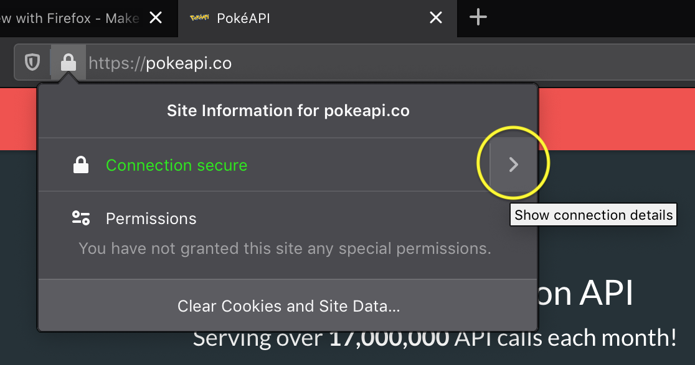
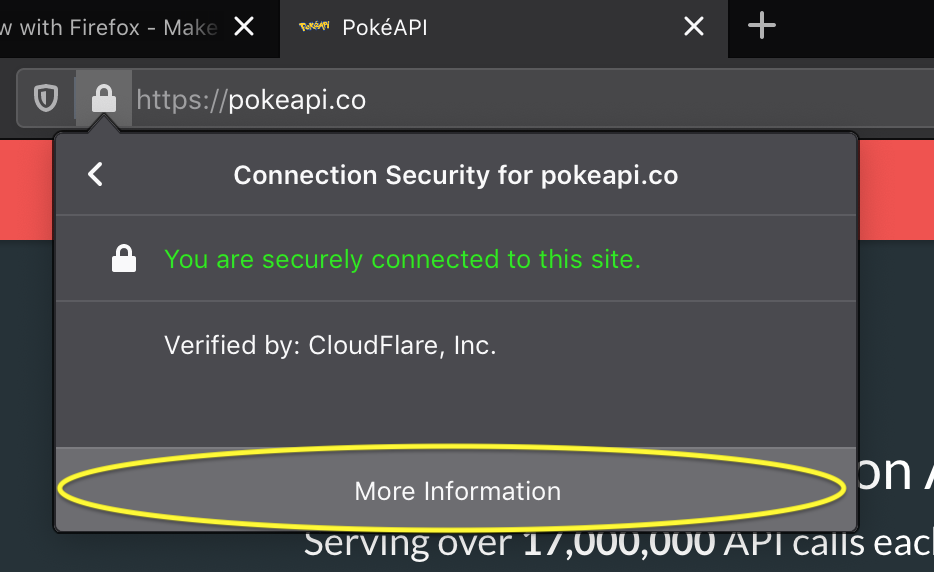
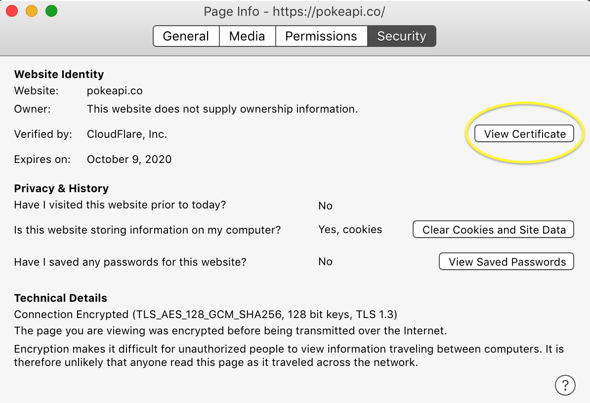
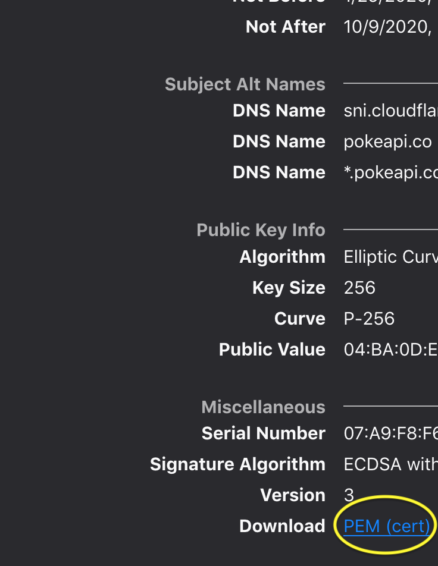

Updated March 23, 2020

#  Certificate Pinning Sample

A simple demonstration of SSL Pinning in iOS.

## Table of Contents

1. SSL Pinning - General Topics
2. Generating a Certificate
3. Native Pinning - Approach
4. Pinning with Alamofire - Approach
5. Current Difficulties
6. Fixed Issues
7. Future Questions
8. Future Reading
9. References


## 1. SSL Pinning - General Topics

The purpose of SSL Pinning is to avoid a [man-in-the-middle](https://en.wikipedia.org/wiki/Man-in-the-middle_attack) attack, by validating the end-server you are communicating with, then allowing secure, encrypted communications with that server.

The details for HTTPS, SSL, handshaking, etc will not be discussed in this document.

Two options exist for SSL Pinning.

1. Certificate Pinning
2. Public Key Pinning

These two options differ in usage generally by:

1. Certificates are typically short-lived, and can be revoked if compromised. Needs setup with a certificate-granting authority.

2. Public-Private Key pairs are typically long-lived and more stable, but, are difficult to revoke if compromised.

The usage of one or another can be to the discretion of an organization, and thus, will not be discussed here.


## 2. Generating a Certificate

Viewing all certificates

```
openssl s_client -connect <domain.co>:443 </dev/null`
```

Downloading a `cer`

```
openssl s_client -showcerts -connect <www.domain.co>:443 < /dev/null | openssl x509 -outform DER > <domainco>.cer`
```

Downloading a `cert`

```
echo -n | openssl s_client -connect HOST:PORTNUMBER \
    | sed -ne '/-BEGIN CERTIFICATE-/,/-END CERTIFICATE-/p' > /tmp/$SERVERNAME.cert
```

#### This application used the following commands:

Certificates were downloaded from .PEM files present in Firefox Browser 74.0.









Converting .PEM files to .cer

```
openssl x509 -inform PEM -in github-com.pem -outform DER -out github-com.cer
```


## 3. Native Pinning - Approach

This is implemented in `NetworkManager` in the `NativePinning` framework.

`URLSession` has a delegate, `URLSessionDelegate` for handling authentication challenges.

The function in question is
```public func urlSession(_ session: URLSession,
            didReceive challenge: URLAuthenticationChallenge,
            completionHandler: @escaping (URLSession.AuthChallengeDisposition, URLCredential?) -> Void)
```

The challenge can be used to retrieve the certificate(s) from the server, then compare if they are the same as any existing certificates, per pinning.


## 4. Pinning with Alamofire - Approach

`AlamoNetworkManager.swift` in the `AlamoPinning` framework implements this.

Alamofire's wrapper for URLSession, aptly-named `Session` can be created with a `ServerTrustManager`, which allows for multiple evaluators to be used.

These include:
* `PinnedCertificatesTrustEvaluator` - certificate-pinning
* `PublicKeysTrustEvaluator` -  public key-pinning


## 5. Current Difficulties

#### 1. Trust persists

Any trusted certificates made seem to be long-lived, and don't actively call the `URLSessionDelegate` methods until the app is deleted & reinstalled.

Not sure how to "reset" it.


## 6. Fixed Issues

~~#### 1. Can't pin image for Alamofire~~

~~Had the same issue with the native approach, but solved by downloading a copy of the certificate that the server had provided.~~

~~Hypothesis: missing/misusing some certificate, especially since loading in the native approach isn't being used by Alamofire.~~

Received error when performing Certificate pinning for image download:

```
serverTrustEvaluationFailed(reason: Alamofire.AFError.ServerTrustFailureReason.noRequiredEvaluator(host: "raw.githubusercontent.com"))
```

Resolved by:
Adding `raw.githubusercontent.com` as a host for GitHub certificates.


## 7. Future Questions

to be completed.

## 8. Future Reading

[Alamofire - Advanced Usage, Security](https://github.com/Alamofire/Alamofire/blob/master/Documentation/AdvancedUsage.md#security)

[Stack Overflow - Certificate Pinning in Alamofire](https://stackoverflow.com/questions/34611112/certificate-pinning-in-alamofire)

[Apple Developer - Performing Manual Server Trust Authentication](https://developer.apple.com/documentation/foundation/url_loading_system/handling_an_authentication_challenge/performing_manual_server_trust_authentication)

[Apple Developer - Handling An Authentication Challenge](https://developer.apple.com/documentation/foundation/url_loading_system/handling_an_authentication_challenge)


## 9. References

#### 1. Certificate Pinning

[Stack Overflow - Difference between Certificate Pinning and Public Key Pinning](https://security.stackexchange.com/questions/85209/difference-between-certificate-pinning-and-public-key-pinning)

[OWASP.org - Certificate and Public Key Pinning](https://owasp.org/www-community/controls/Certificate_and_Public_Key_Pinning)

[Infinum.com - SSL Pinning Revisited](https://infinum.com/the-capsized-eight/ssl-pinning-revisited)

[Serverfault - How to Download the SSL from a Website](https://serverfault.com/questions/139728/how-to-download-the-ssl-certificate-from-a-website)

[Stack Overflow - Virtual Hosts](https://stackoverflow.com/questions/53965049/handshake-failure-ssl-alert-number-40)

* PokéAPI uses a virtual host.

[Couchbase - Certificate Pinning Mobile iOS App](https://blog.couchbase.com/certificate-pinning-couchbase-mobile-ios-app)

[](https://medium.com/flawless-app-stories/ssl-pinning-with-alamofire-5-538ad7b8ee0f)
